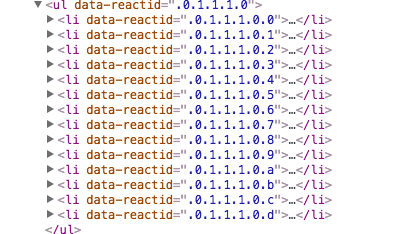
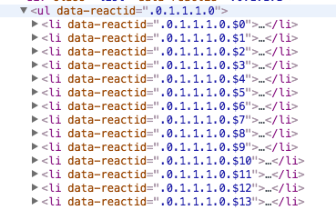

# 常见错误

## 1. React循环生成相同元素时,建议使用key,例如循环生成li

这并不会引起编译错误,但会引起一个warning

```xml
Warning: Each child in an array or iterator should have a unique "key" prop.
```

我原先的代码是这样的

```javascript
this.props.fields.map(function(value){
    return (
        <li>
            ...
        </li>
    )
});
```

生成的li长这样



然后我往li里放了一个key

```javascript
this.props.fields.map(function(value,index){
    return (
        <li key="{index+3}">
            ...
        </li>
    )
});
```

然后生成的ul是这样的



我是根据JSON然后生成多个li元素,但是React建议我为每个li添加一个key元素

React为什么建议我们这样做,是为了让li更快的排序和摧毁.(笔者有点奇怪,react默认会生成reactid啊,为啥还要让我们自定义key)

假如往ul里放li,应该在ul里定义的li放key.

例如当li又是一个React组件,在li组件返回li中定义key是不好的,应该在ul中明显调用这个组件时就定义key


参考资料

<http://facebook.github.io/react/docs/multiple-components.html#dynamic-children>