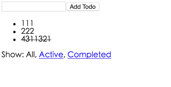

# Todos



# 1. 功能解析

1. 添加todo
2. 点击todo,切换active|completed状态
3. 分类显示

# 2. 功能点解析

## 2.1 添加todo

添加todo的思路就是

点点击`Add Todo`时,当文本框分空,即提交todo

就是执行

1. `dispatch(addTodo(input.value))`;
2. `AddTodo = connect()(AddTodo)`: 将`AddTodo`组件里的dispath和Redux连接起来

`connect()(AppTodo)`的作用就是将AddTodo组件中的dispath交给Redux处理.

View层就就是发送这个通知,后面的事情就不得而知了.

这个文本框和提交按钮的任务就完成了,只负责提交内容,store里的变化与它无关

OK,但是这个addTodo(input.value)究竟咋执行啊

`addTodo`的实现方法放在action中.

```javascript
export const addTodo = (text) => {
  return {
    type: 'ADD_TODO',
    id: nextTodoId++,
    text
  }
}
```

啊..action就是定义了这些东西..action指定了动作的类型,和传输的数据.

恩.通过这里我知道增加一个todo,他的id是`nextTodoId++`,内容为text

然后呢?这就改变了传说中Redux的store了吗.啊.同志们别着急.

我们之前在view里写的是`dispatch(addTodo(input.value))`

所以要把这个addTodo返回的内容,通过dispath发送给Store啊.

啊Store里收到action给我返回的内容,我应该怎么改变自己的内容啊 T_T..

这里就是通过`reducer`拉.

```javascript
const todos = (state = [], action) => {
  switch (action.type) {
    case 'ADD_TODO':
      return [
        ...state,
        {
        id: action.id,
        text: action.text,
        completed: false
        }
      ]
    ...
    default:
      return state
  }
}
```

这里的`...state`是原先包含的`todos`啦,加上新来的嘛,这就是新的state

OK 我们已经提交todo到store啦.

但是我们在下面的ul中添加新的todo啊..咋设置它呢? 下面继续介绍这个功能点.

## 2. 显示todos

先说明todos要做的功能

1. 显示你当前筛选的类型todos

2. 点击todo,状态取反

这里有容器和显示组件的说明

|            | 容器组件              | 展示组件              |
|------------|-----------------------|-----------------------|
| 位置       | 最顶层，路由处理      | 中间和子组件          |
| 使用 Redux | 是                    | 否                    |
| 读取数据   | 从 Redux 获取 state   | 从 props 获取数据     |
| 修改数据   | 向 Redux 发起 actions | 从 props 调用回调函数 |


我们这里先定义容器组件,这里的容器组件,作用是筛选要显示的todo和设定dispath

```javascript

const getVisibleTodos = (todos, filter) => {

  switch (filter) {
    case 'SHOW_ALL':
      return todos
    case 'SHOW_COMPLETED':
      return todos.filter(t => t.completed)
    case 'SHOW_ACTIVE':
      return todos.filter(t => !t.completed)
  }
}

const mapStateToProps = (state) => {
  return {
    todos: getVisibleTodos(state.todos, state.visibilityFilter)
  }
}

const mapDispatchToProps = (dispatch) => {
  return {
    onTodoClick: (id) => {
      dispatch(toggleTodo(id))
    }
  }
}

const VisibleTodoList = connect(
  mapStateToProps,
  mapDispatchToProps
)(TodoList)

export default VisibleTodoList
```

这里主要设定了两个函数

1. mapStateToProps: 当store 发生改变，mapStateToProps 被调用。mapStateToProps必须返回一个纯对象，这个对象会与组件的 props 合并.
2. mapDispatchToProps: 返回一个Object|Function

    1. 返回Object: 对象里的函数都是Redux action creator,而且这个Object会与store绑定在一起,其定义的方法名作为属性名合并到组件的props中.
    2. 返回Function: 该函数会接受dispath函数,然后再由你决定如何返回一个对象,这个对象通过dispath与action creator绑定在一起.

