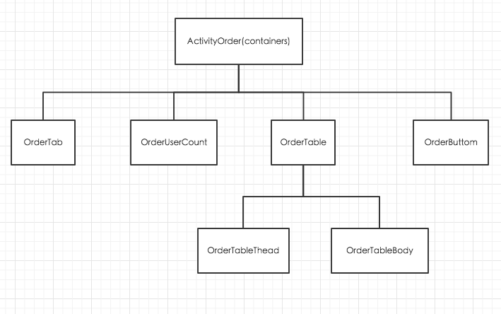

# 统计table选择列总数

## 1.Redux+React的调用机制

先来看看Redux的架构图

Views通过用户的交互而触发了`Action Creators`

`Action Creators`的作用就是return一个`Action`

`Action`一般为一个数据对象,该数据对象的作用是给reducer作为参考,如何改变Store

## 2. 功能分析

先看一下重构师给出的页面效果

额其实功能很简单.

1. 左上角有统计总人数
2. 人数列可以勾选上
3. 左下角有统计勾选的人数

## 3. 分解View模块

把View分解成这样的组件,然后通过AcitivityOrder这个容器去调用他们.

至于容器和组件的区别有

|            | 容器组件              | 展示组件              |
|------------|-----------------------|-----------------------|
| 位置       | 最顶层，路由处理      | 中间和子组件          |
| 使用 Redux | 是                    | 否                    |
| 读取数据   | 从 Redux 获取 state   | 从 props 获取数据     |
| 修改数据   | 向 Redux 发起 actions | 从 props 调用回调函数 |

简单点来说,`action creator`和全局的`state`都是在容器中引用的

然后容器可以根据组件所要满足的功能,然后一层层的把部分`action creator`和`state`往组件传递

